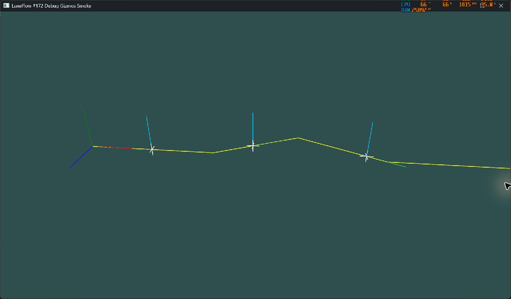

# v0.7 Bevy debug Gizmos 验证

**文档状态**: G3 候选（本地验证通过）

**最后更新**: 2026-07-21

**适用范围**: #172 的可选、预算受控 Bevy debug Gizmos，以及对应的 headless、依赖图和本机可视 smoke 证据

**来源基线**: `origin/main@e9279095f2eea6bdb21fdb814489bfb792f48dea`

**关联文档**:

- `../design/bevy-reference-adapter.md`
- `../governance/development-gates.md`
- `validation-matrix.md`
- `../../crates/laneflow-bevy/README.md`

## 1. 结论摘要

- `debug-gizmos` 保持非默认 opt-in；默认 `laneflow-bevy` graph 仍只有 `bevy_app`、`bevy_ecs`、`bevy_time`、`bevy_transform`、`laneflow-core` 与 `laneflow-spatial` 六个根依赖，不包含 umbrella `bevy`、Gizmos、window 或 renderer。
- debug 系统只读取当前 outer frame 通过完整 Adapter 校验的 presentation batch。当前批次失败时 validated 标记先失效，不回退到上一帧。
- frame axes、车辆 position/forward/up marker、车辆 membership filter、车辆预算与中心线 segment 预算均由显式运行时配置控制；默认配置关闭且预算为零。
- 调用方中心线带有 `CanonicalFrameId`，只按输入顺序展开 segment；Adapter 不计算长度、不重采样，也不建立第二个 `SpatialRegistry`。
- `debug-gizmos` graph 包含 modular Gizmos/window 支持，但不包含 renderer 或 umbrella `bevy`；完整 render/window 只由 `debug-gizmos-smoke` 激活。
- smoke feature 使用最小显式 Bevy feature 集合：3D render、winit、X11、默认 App 基础、multi-threaded 与 `std`。它不启用粗粒度 `default_platform` 或 Wayland；全 feature graph 中不再包含 `quick-xml`，RustSec advisory 扫描通过。
- Rust 1.96.0 默认/feature-on tests、workspace all-features tests、Clippy `-D warnings`、rustdoc `-D warnings`、metadata、rustfmt 与 Markdown table check 已通过。本机 Bevy 3D 窗口 smoke 已显示 frame axes、三辆车 marker 与 caller-provided 中心线。
- `cargo-deny` 的 advisories、bans、licenses 与 sources 已全部通过。七个精确 crate/version 的五类宽松许可证例外已按 #172 治理批准写入 `deny.toml`，没有扩大全局 allow-list。

## 2. 工具链与依赖图

| 项目  | 实际值                                |
| ----- | ------------------------------------- |
| Rust  | `rustc 1.96.0 (ac68faa20 2026-05-25)` |
| Cargo | `cargo 1.96.0 (30a34c682 2026-05-25)` |
| LLVM  | `22.1.2`                              |
| Host  | `x86_64-pc-windows-msvc`              |
| Bevy  | `0.19.0`，由 `Cargo.lock` 固定        |

依赖边界检查：

```powershell
cargo +1.96.0 tree -p laneflow-bevy --no-default-features --edges normal --locked --offline
cargo +1.96.0 tree -p laneflow-bevy --features debug-gizmos --edges normal --locked --offline
cargo +1.96.0 tree -p laneflow-bevy --all-features --edges normal --locked --offline
```

结果：

| 检查                                                                      | 结果 |
| ------------------------------------------------------------------------- | ---- |
| default graph 中的 `bevy` / `bevy_gizmos` / `bevy_window` / `bevy_render` | `0`  |
| `debug-gizmos` graph 中的 umbrella `bevy` / `bevy_render`                 | `0`  |
| all-features graph 中的 `quick-xml`                                       | `0`  |

## 3. 行为与失败语义

headless 集成测试覆盖：

1. 宿主没有先安装 `GizmoPlugin` 时只报告 `MissingGizmoPlugin`，不注册会访问缺失资源的系统。
2. 车辆预算按 validated batch 顺序稳定截取，并报告 eligible/drawn/truncated、首尾 vehicle 和 emitted segment 数。
3. allow-list 只改变 membership，不改变 batch 顺序；关闭 debug 不改变 presentation report、Core、Spatial、映射或 Transform。
4. 无效 debug 尺寸和中心线 frame mismatch 只影响 debug report，不使 presentation 失败。
5. 前一帧成功、当前帧因 stale mapped Entity 校验失败时，debug 报告 `NoValidatedBatch`、输出零 segment，证明没有 stale fallback。
6. all-features 下，Bevy mesh integration 会为 `GizmoPlugin` 增加 skinned-mesh bounds 系统；测试宿主按 feature 条件初始化该系统要求的两个 Asset Resource，仍不安装 window 或 renderer。

主要复现命令：

```powershell
cargo +1.96.0 test -p laneflow-bevy --no-default-features --locked --offline
cargo +1.96.0 test -p laneflow-bevy --features debug-gizmos --locked --offline
cargo +1.96.0 test -p laneflow-bevy --test debug_gizmos --all-features --locked --offline
cargo +1.96.0 test --workspace --all-features --locked --offline
```

结果：全部通过；`debug_gizmos` 集成测试为 `5 passed; 0 failed`。workspace 中仅保留仓库原有、需要显式固定机或串行命令的 ignored tests。

## 4. 编译质量门

```powershell
cargo +1.96.0 check -p laneflow-bevy --no-default-features --all-targets --locked --offline
cargo +1.96.0 check -p laneflow-bevy --example debug_gizmos_smoke --features debug-gizmos-smoke --locked --offline
cargo +1.96.0 clippy -p laneflow-bevy --all-targets --all-features --locked --offline -- -D warnings
$env:RUSTDOCFLAGS = '-D warnings'
cargo +1.96.0 doc -p laneflow-bevy --all-features --no-deps --locked --offline
cargo +1.96.0 metadata --locked --format-version 1 --offline
cargo +1.96.0 fmt --all -- --check
cargo +1.96.0 run --locked -p xtask -- format-md-tables --check README.md AGENTS.md CONTRIBUTING.md crates docs research schemas .github .agents .cursor
git diff --check
```

结果：全部通过。Windows 偶发的 incremental compilation `os error 5` 只表示该轮缓存目录不能复用；命令退出码和编译产物均成功，不作为功能失败掩盖。

## 5. 本机可视 smoke

运行命令：

```powershell
cargo +1.96.0 run -p laneflow-bevy --example debug_gizmos_smoke --features debug-gizmos-smoke --locked
```

smoke 使用 `TimeUpdateStrategy::ManualDuration(Duration::ZERO)` 固定三辆车，避免截图等待期间 Core 把车辆驶出短场景。观察结果：

- 左侧 RGB frame axes 可见；
- 三辆车的白色 position cross、亮绿 forward 与亮蓝 up marker 可见；
- 黄色 caller-provided 弯折中心线可见；
- 中心线先绘制，车辆 marker 后绘制，同位置诊断线不会被中心线遮盖；
- 窗口正常退出，无 crash 或 permission dialog。



截图 SHA-256：`d2503d46434b6cb27fd2d76fd118773010ffc03563d61e3c198828f0681a013d`。

## 6. 依赖与安全

最小 smoke feature 已移除 `default_platform`/Wayland，因此不再锁入 `quick-xml 0.39.4`；离线 advisory DB 对当前 all-features graph 报告 `advisories ok`。

```powershell
cargo deny --offline --locked --all-features check advisories bans licenses sources
```

离线完整策略结果：

| Policy     | 结果 |
| ---------- | ---- |
| advisories | Pass |
| bans       | Pass |
| sources    | Pass |
| licenses   | Pass |

批准的例外精确绑定 crate/version，没有把许可证加入全局 allow-list：

| 许可证         | 精确 crate                                                           |
| -------------- | -------------------------------------------------------------------- |
| `BSD-2-Clause` | `arrayref 0.3.9`                                                     |
| `MIT-0`        | `encase 0.12.0`、`encase_derive 0.12.0`、`encase_derive_impl 0.12.0` |
| `CC0-1.0`      | `hexf-parse 0.2.1`                                                   |
| `ISC`          | `libloading 0.8.9`                                                   |
| `BSD-3-Clause` | `pp-rs 0.2.1`                                                        |

这些许可证均为宽松许可证，不引入 copyleft。`deny.toml` 同时记录了业务必要性、替代方案、影响、接受范围、复审触发条件、清理负责人和跟踪 Issue。例外只接受表中的精确版本；Bevy 升级或版本漂移必须重新审查。

在线命令同样执行了完整策略检查，但在拉取 RustSec advisory DB 时由 GitHub 连接重置而退出，错误为 `Recv failure: Connection was reset`。这属于外部网络刷新失败，不覆盖离线固定 advisory DB 的通过结果；G3 仍需以 Delivery PR 上的在线 CI/security checks 作为最终远端证据。

## 7. 范围边界

- #172 不读取校园场景 artifacts，也不替代 #171 的 E2E/10k/100k 验证。
- #172 的 smoke 只证明 debug Gizmos 的真实 render/window 路径；#173 仍负责完整最小 native reference example。
- 本切片不改变 Core API、数据格式或 Spatial authority；新增的是 Bevy-specific Adapter API。
- screenshot 是可视 smoke 证据，不替代 headless deterministic tests、dependency policy 或 CI。
