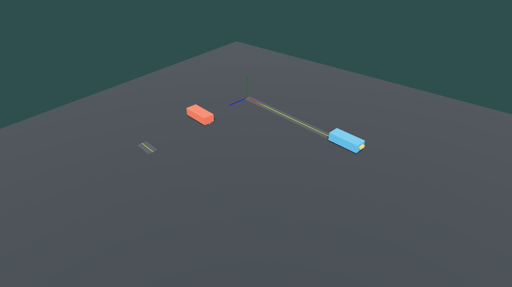

# v0.7 Bevy native reference example 验证

**文档状态**: Accepted

**最后更新**: 2026-07-21

**适用范围**: #173 的 campus native reference example、feature/依赖边界、dedicated compile、运行时诊断和本机窗口 smoke 证据

**来源基线**: `origin/main@5bf24a9b943383e99ac34564aeed93eb6f4d03e8`

**关联文档**:

- `../design/bevy-reference-adapter.md`
- `v0.7-bevy-validation.md`
- `v0.7-bevy-debug-gizmos-validation.md`
- `../../crates/laneflow-bevy/README.md`

## 1. 结论摘要

- `native-example` 保持非默认 opt-in，并复用 #172 已审计的 3D/window/render/Gizmos 依赖集合；默认 production graph 不包含 umbrella `bevy`、renderer、window 或 Gizmos。
- 示例从仓库 `examples/data/` 读取现有 campus manifest、traffic artifact 与 spatial artifact；production loader 对引用名、media type、size 与 SHA-256 完成校验后，再构造 Core/Spatial/Adapter 闭环。
- 两辆可见 vehicle 由 Core fixed tick 推进，经稳定 Spatial batch 和 #170 的 Vehicle/Entity + frame-root/token 路径写入 proxy local Transform；内建道路/车辆几何只属于 presentation/example。
- 非原点 frame-root、`1 LaneFlow meter = 1 Bevy unit`、直接 child proxy 和模型 child 分层在真实 Bevy window 中通过本机 smoke。
- `G` 已实际验证可在运行中关闭并重新启用 debug Gizmos，窗口标题同步报告 `OFF/ON`；`F12` 已保存本次截图。
- CI 增加 dedicated example compile。GUI smoke 不替代 #171 的 campus headless determinism、workspace tests 或 dependency policy。

## 2. 工具链与输入制品

| 项目  | 实际值                                |
| ----- | ------------------------------------- |
| Rust  | `rustc 1.96.0 (ac68faa20 2026-05-25)` |
| Cargo | `cargo 1.96.0 (30a34c682 2026-05-25)` |
| LLVM  | `22.1.2`                              |
| Host  | `x86_64-pc-windows-msvc`              |
| Bevy  | `0.19.0`，由 `Cargo.lock` 固定        |

运行时读取并由 loader 校验：

- `examples/data/v0.1-campus.scenario.json`；
- `examples/data/v0.5-empty-signals-and-parking.laneflow.json`；
- `examples/data/v0.1-campus.spatial.json`。

示例不复制 JSON、不绕过 loader，也不要求外部 glTF、texture、prefab 或 scene asset。

## 3. Feature 与依赖边界

`native-example` 只作为 example 的 required feature：

```text
native-example
  -> debug-gizmos
  -> umbrella bevy（显式 3D render、winit、default app、multi-threaded、std、X11）
  -> bevy_mesh
```

它与 `debug-gizmos-smoke` 激活相同的 normal dependency 集，因此没有修改 `Cargo.lock`、没有新增 crate/version、没有扩大既有 all-features 图。production 默认 graph 仍只有 modular `bevy_app`、`bevy_ecs`、`bevy_time`、`bevy_transform`、`laneflow-core` 与 `laneflow-spatial` 六个根依赖。

复现命令：

```powershell
cargo +1.96.0 tree -p laneflow-bevy --no-default-features --edges normal --locked --offline
cargo +1.96.0 tree -p laneflow-bevy --features native-example --edges normal --locked --offline
```

2026-07-21 对基线 `main@5bf24a9b` 的 GitHub 实时审计结果：CodeQL default setup 为 `configured`，覆盖 `actions`/`rust`，最近 main analysis 成功且 `results_count = 0`；Secret Scanning、push protection 与 Dependabot security updates 均为 `enabled`；Code Scanning、Secret Scanning 与 Dependabot open alerts 均为 `0`。这份快照不替代 Delivery PR 自身的 CodeQL、Dependency policy 和 required checks；G3 仍须等待 PR head 的适用检查完成。

## 4. 编译与回归验证

Dedicated compile 同时写入共享 CI：

```powershell
cargo +1.96.0 check -p laneflow-bevy --example native_reference --features native-example --locked
```

本地交付验证还执行：

```powershell
cargo +1.96.0 fmt --all -- --check
cargo +1.96.0 test --workspace --locked
cargo +1.96.0 clippy -p laneflow-bevy --all-targets --all-features --locked -- -D warnings
$env:RUSTDOCFLAGS = '-D warnings'
cargo +1.96.0 doc -p laneflow-bevy --all-features --no-deps --locked
cargo deny --offline --locked --all-features check advisories bans licenses sources
cargo +1.96.0 run --locked -p xtask -- format-md-tables --check README.md AGENTS.md CONTRIBUTING.md crates docs research schemas .github .agents .cursor
git diff --check
```

结果：全部通过。Windows 偶发的 incremental compilation `os error 5` 只表示该轮缓存目录不能复用；成功命令的退出码和产物不受影响。

## 5. 本机可视 smoke

从仓库根目录运行：

```powershell
cargo +1.96.0 run -p laneflow-bevy --example native_reference --features native-example --locked
```

实际观察：

- Bevy 3D/window/render 正常启动，未出现 crash 或 permission dialog；
- 非原点 campus frame-root 的 RGB axes、黄色 caller-provided centerlines 与内建道路几何可见；
- 红色与蓝色 vehicle model 由 direct-child proxy 承载，前端黄色 marker 指明 Bevy `-Z` forward；
- `G` 关闭后 axes/centerlines 消失且窗口标题为 `Gizmos: OFF`，再次按下后恢复并显示 `Gizmos: ON`；
- `F12` 成功保存 `1,280 x 720` 窗口内截图，示例在保存后继续响应；
- 关闭窗口正常退出。



截图 SHA-256：`5149eb41e0603e67d044bc84e96e2584d3c724ab4a2806b714aeb6a13f9db52c`。

## 6. 失败诊断

启动路径分别为文件读取、scenario/引用制品校验、Traffic/Spatial normalization、SpatialRegistry 构造和 CoreWorld 构造增加阶段上下文。文件错误包含完整路径；manifest/artifact 错误保留 production loader 的结构化 source。运行中 Adapter 的 Core step、frame/token、mapping、Entity/parent、finite value 或 Transform 失败继续由 `LaneFlowAdapterError` 表达，并由示例日志只在错误状态变化时报告。

feature 缺失由 Cargo 的 `required-features = ["native-example"]` 在目标选择阶段拒绝，并提示所需 feature；不会退化为缺 renderer/window 的半可运行示例。

## 7. 范围边界

- 本切片不改变 Core API、data format、Spatial authority 或 production Adapter API。
- camera、input、renderer、mesh/material、road presentation 和 screenshot 只存在于 `examples/native_reference.rs`。
- 本切片不冻结 glTF、prefab、scene、asset pipeline、UI、插值、LOD/pooling、WASM 或第二个引擎示例。
- 本机截图只证明真实 window/render 与交互路径；确定性、失败原子性、10k/100k allocation/performance 继续以 #171 的 headless/固定机证据为准。
