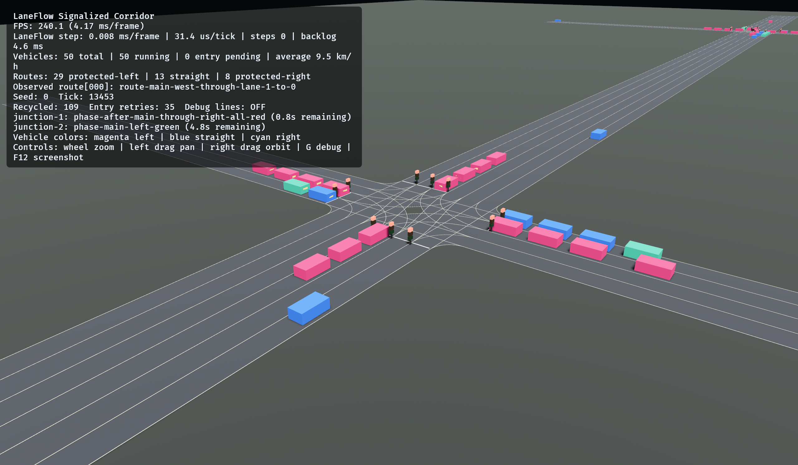
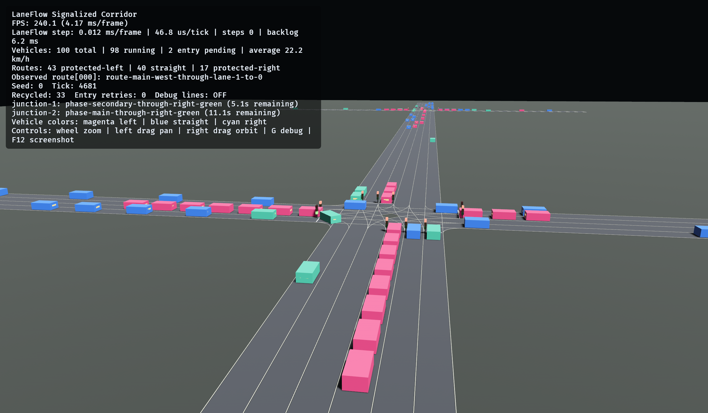
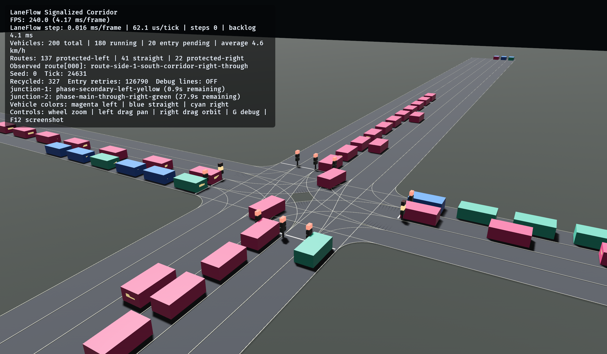

# v0.9 signalized corridor cross-layer 验证

**文档状态**: Accepted

**最后更新**: 2026-07-26

**适用范围**: #191 的 50/100/200 人口、stress seeds、回流与生命周期、
chunking replay、灯具一致性、speed×signal 组合、制品长度绑定与性能/有界性
统一 cross-layer 证据

**关联文档**:

- `../design/example-scenarios.md`（§11 验收矩阵）
- `../design/signalized-corridor-population.md`
- `v0.9-protected-turning-native-validation.md`（#190 最小 native smoke）

## 1. 结论摘要

- `example-scenarios.md` §11 验收矩阵十行均有 deterministic headless 证据；
  50/100/200 三规模的初始化 golden、Core batch no-overlap 与 tick-0 bind 由
  #190/#229 既有 scenario 测试保持，本切片补齐运行时与规模缺口。
- 200 车全栈 headless soak 运行 30,000 tick（覆盖 GUI 观察到 entry
  pending 20 的 tick 24,631 horizon）：真实发生 407 次 completion、382 次
  replacement 与 253,690 次 blocked retry；pending FIFO 实测峰值 27，
  结构设计边界 pending ≤ target = 200 逐帧断言，
  `running + pending = 200` 逐帧恒定，无 unbounded queue 或 retained growth。
- 稳态 lifecycle 逐类操作零分配，且整个 10,000 次 completion/replacement
  轮换循环在单一 allocator region 内全程零分配（50 与 200）；outer-frame
  chunking replay 一致性覆盖 50/100/200。
- stress seed 矩阵（3 规模 × seeds `0/7/42/101`）全部真实回流，
  `completed == replaced + final_pending` 处处成立。
- native GUI smoke 覆盖 50/100/200（seed 0），左/直/右、灯具、排队与回流
  可见；HUD step 成本随人口线性，未观察到异常。
- 本证据不外推 renderer SLA、专业交通工程 fidelity 或城市容量承诺。

## 2. Headless 证据

所有测试在 Windows、Rust 1.96 debug 下通过；复现命令见第 6 节。

| 矩阵行   | 证据                                                                                                                                                                                                                        | 规模 / seed |
| -------- | --------------------------------------------------------------------------------------------------------------------------------------------------------------------------------------------------------------------------- | ----------- |
| 几何     | generator 锁 66/32/28/212 exact counts 与 byte-deterministic；`traffic_and_spatial_lengths_match_independently_for_all_66_edges` 逐边独立重算折线长，差 ≤ 1e-3 m                                                            | N/A         |
| 限速     | 60/40/25/15 公示值 generator 锁值；Core `speed_limits` 制动/组合；`red_signal_stop_dominates_the_sixty_to_forty_transition_until_green` 证明红灯严格强于 60→40 限速包络                                                     | 合成单车    |
| 信号     | 2 controller/8 group/12 phase/offset `[0, 42000]` 双锁；冲突 movement 不同时开放（制品层）；`signal_lamps_track_committed_group_aspects_across_phase_switches` 60 灯具逐帧对 committed aspect，覆盖完整 84 s 周期与相位切换 | 50 @ 5      |
| 人口     | 三规模 golden（seed 0）、Core batch no-overlap 与 tick-0 bind（seed 42，既有）；`production_bootstrap_supports_50_100_and_200`；非法范围与容量不足明确失败                                                                  | 50/100/200  |
| 回流     | 三 draw site、blocked 不重抽、同 tick 顺序 golden 参数化到三规模；`headless_soak_200_recycles_population_with_bounded_pending_fifo` 见第 3 节                                                                               | 50/100/200  |
| 生命周期 | Core 原子轮换、Adapter same-Entity、controller 契约（既有）+ soak/stress 全栈轮换                                                                                                                                           | 50/100/200  |
| 确定性   | scenario 三规模 × 三种切分（seed 77）；example 三规模 4,000 tick 双切分（seed 17）Core 全量相等；golden PRNG                                                                                                                | 50/100/200  |
| 制品     | byte-deterministic、checked-in 逐字节相等、Manifest size/digest、production loader 往返（既有）                                                                                                                             | N/A         |
| 可视     | 左/直/右 Core handle 证据、protected traversal/stop/release/queue/pose（100 @ 0/7/11/13，既有）；灯具一致性见信号行；GUI 见第 4 节                                                                                          | 50/100/200  |
| 性能     | `steady_lifecycle_is_allocation_free_and_retained_capacity_is_bounded` 逐类操作零分配，且 10,000 次 completion/replacement 轮换循环在单一 allocator region 内全程零分配（50/200 @ 11）；200 车 soak 有界性见第 3 节         | 50/200      |

## 3. 200 车长程 soak 与 stress seed 矩阵

`headless_soak_200_recycles_population_with_bounded_pending_fifo`（example
测试，真实 production bootstrap + Core step + Adapter lifecycle 全栈）：
200 车 seed 0，3,750 outer frame × 8 tick = 30,000 tick，覆盖第 4 节 GUI
观察到 entry pending 20 的 tick 24,631 horizon。completed = 407、
replaced = 382、blocked = 253,690，终态 pending = 25：入口饱和后 pending
在数十量级稳定波动。pending 上界分两层断言：

- 结构边界（设计不变量）：每个 logical slot 只有 Running/Pending 两态，
  pending 总数结构上 ≤ target = 200，由共享辅助 `run_headless_soak` 与
  `running + pending = target` 一起逐帧断言；
- 经验浅队列上界：本回放实测峰值 27，断言上界 64（实测 2.4 倍余量），
  锁死“饱和后 pending 不随运行时长持续增长”的契约。

逐帧无 Adapter 错误；200 个 logical identity 始终绑定原 proxy entity。

`stress_seed_matrix_keeps_population_stable_through_real_recycling`：
50/100 运行 5,000 tick、200 运行 8,000 tick，seeds `0/7/42/101`。12 组全部
真实回流（completed/replaced 26–109），实测 pending 峰值最大 5（200 @ 42
高拥堵，blocked = 2,165），经验上界 16 为实测 3.2 倍余量；结构边界与
不变量 `completed == replaced + final_pending` 处处成立。更长 horizon 的
200 车 pending 峰值证据由 soak 承担。

## 4. 本机 native GUI smoke

`E:/projects/worktrees/main-v09` 下以 release 运行默认 config，seed 0：

| 人口 | Tick   | Running | Entry pending | Recycled | HUD step                | 可见状态                                        |
| ---- | ------ | ------- | ------------- | -------- | ----------------------- | ----------------------------------------------- |
| 50   | 13,453 | 50      | 0             | 109      | 0.008 ms / 31.4 µs/tick | 三类车辆、双路口灯具；j1 all-red、j2 主路左转绿 |
| 100  | 4,681  | 98      | 2             | 33       | 0.012 ms / 46.8 µs/tick | 43 左转 / 40 直行 / 17 右转；排队与相位正常     |
| 200  | 24,631 | 180     | 20            | 327      | 0.016 ms / 62.1 µs/tick | 入口饱和持续回流；j1 次路左转黄、j2 主路直右绿  |

`running + entry pending = target` 在三规模全部保持。200 车 GUI 在 tick
24,631 的 entry pending 20 与 headless soak（30,000 tick，含该 horizon）
实测峰值 27、终态 25 处于同一饱和量级，三者关系为：结构边界 pending
≤ target = 200 是设计保证；headless 30,000 tick 实测峰值 27 与 GUI
24,631 tick 观测 20 都在该边界之内，也都在经验断言上界 64 之内。
HUD step 成本为 example-local 诊断，不构成 renderer 或跨机器 SLA。

`F12` 窗口截图：







截图 SHA-256：

- 50：`0e45928962fa93f0434aebd0ae0ffa08acbf0c125628b9a47fb055903bef8003`
- 100：`d97f7715115d20293c83a29250e205cc2a9f56ff3642eb44df851ce911c90c66`
- 200：`8c5bcf59df46367de84c583324f2dc5998e5d4e1aae9de3ca53c4bcdb8c00903`

## 5. 证据边界

- GUI smoke 证明真实 Windows window/render/input 路径下的三规模可视运行，
  不证明其他平台支持，也不替代 deterministic headless tests。
- 性能记录只覆盖 50–200 车 example-local step 成本与有界性，不外推 10k/100k
  或城市规模；10k/100k 性能由 #215/#216/#217 的专项 workload 承担。
- `cargo +1.96.0 test --locked -p laneflow-bevy --features native-example`
  全量运行时，`debug_gizmos` target 4 个测试因 feature-matrix 问题失败；
  该问题在 #191 开工前已存在，CI 不运行该组合，已登记 #249 跟踪，不属本
  切片修复范围。
- 本切片只新增/扩展测试与本文档，未改变 production runtime、schema、
  data format 或 Adapter API；不声明 #192、#194 或 v0.9 完成。

## 6. 复现命令

```powershell
cargo +1.96.0 test --locked -p laneflow-bevy --features native-example --example signalized_corridor
cargo +1.96.0 test --locked -p laneflow-scenario
cargo +1.96.0 test --locked -p laneflow-core --test speed_limits
cargo +1.96.0 test --locked -p laneflow-corridor-generator --test corridor
cargo +1.96.0 run --release --locked -p laneflow-bevy --example signalized_corridor --features native-example -- --vehicles <50|100|200> --seed 0
```
