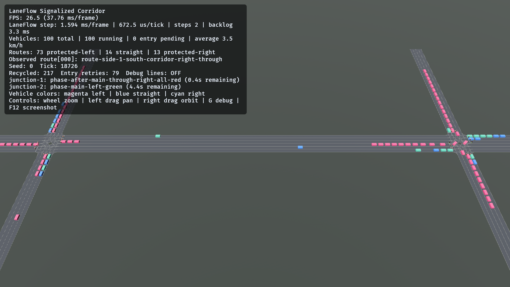

# v0.9 protected turning native example 验证

**文档状态**: Accepted

**最后更新**: 2026-07-25

**适用范围**: #190 的 `signalized_corridor` protected-left / straight /
protected-right 最小 Windows native smoke

**关联文档**:

- `../design/signalized-corridor-protected-turning.md`
- `../design/example-scenarios.md`
- `../../crates/laneflow-bevy/README.md`

## 1. 结论摘要

- `signalized_corridor` 从 committed Traffic 0.8、Spatial 0.1、Scenario Manifest
  0.1 与 catalog 0.2 制品启动，默认 `100 vehicles / seed 0` 保持
  `100 running / 0 entry pending`。
- 洋红 protected-left、蓝色 straight 与青色 protected-right 车辆均在真实
  Bevy window 中可见；道路、转向 internal edge、StopLine、signal pole/lamp
  geometry 正常渲染。
- 两个 Junction 的 HUD phase/aspect 随 84 s program 推进；车辆在停止线排队并在
  对应 phase 释放。
- 观察期间 `Recycled` 从 11 增长到 217，车辆总数保持 100。headless
  `recycle_rotates_handles_without_replacing_proxy_entities` 同时锁定 recycle
  只轮换 Core handles，不替换 Adapter proxy Entity。
- 本证据只覆盖 #190 的最小 native smoke，不替代 #191 的 50/100/200、
  stress seeds、phase-clearance、replay、no-overlap、proxy/Transform 与性能矩阵。

## 2. 编译与 headless 验证

本地执行：

```powershell
cargo +1.96.0 test --locked -p laneflow-bevy --example signalized_corridor --features native-example
cargo +1.96.0 check --locked -p laneflow-bevy --example signalized_corridor --features native-example
cargo +1.96.0 build --locked -p laneflow-bevy --example signalized_corridor --features native-example
```

结果：example 的 12 个测试全部通过，dedicated check 与 native build 均通过。
其中 targeted runtime evidence 覆盖 left/straight/right internal traversal、
`SignalStop`、同一 Gate 的后续 release、shared-entry queue、finite non-identity
Adapter pose 与 same-Entity recycle。

## 3. 本机可视 smoke

从仓库根目录运行构建后的 Windows executable：

```powershell
target\debug\examples\signalized_corridor.exe `
  --vehicles 100 `
  --seed 0 `
  --config examples\config\v0.9-signalized-corridor.toml
```

跨时间观察：

| Tick   | Running | Entry pending | Recycled | 可见状态                                     |
| ------ | ------- | ------------- | -------- | -------------------------------------------- |
| 2,341  | 100     | 0             | 11       | 三类车辆、双 Junction phase 与停止线均已加载 |
| 4,354  | 100     | 0             | 30       | 双路口队列随 through/right phase 推进        |
| 11,114 | 100     | 0             | 129      | left phase 生效，转向轨迹与回流持续运行      |
| 18,726 | 100     | 0             | 217      | 保存截图；一处 all-red、一处 left-green      |

初始 HUD 中 `route[000]` 为 main-west straight route；回流后变为
side-1 protected-right route，且同一时段 `100 total / 100 running` 保持不变。
这与 headless proxy identity 断言共同证明 presentation route/material 会随
replacement handle 更新，而不会生成 stale/duplicate proxy。

`F12` 保存的窗口内截图：



截图 SHA-256：
`0deceddf5ac1139e72e916253c0b124891b2362c421f94a41707e797983a611a`。
保存后示例继续运行；最终通过正常窗口关闭退出。

## 4. 证据边界

- 截图证明真实 Windows window/render/input 路径、三类 route presentation、
  lamp/road geometry 与持续 recycle，不证明其他平台支持。
- `Entry retries` 是饱和入口在 frozen replacement plan 上的重试计数；它不执行
  新的随机 draw。截图中的非零值不表示车辆丢失，`running + pending` 始终等于
  target。
- GUI 观察不替代 deterministic headless tests、workspace tests、Clippy、artifact
  equality、dependency policy、CodeQL 或 PR current-head G3。
- #190 不声明 expanded clearance/performance 通过，也不声明 #191、#192、#194
  或 v0.9 完成。
