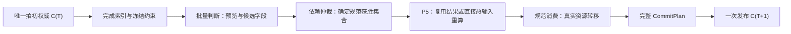

# 整拍批量数据流研究边界

这是 #808 的研究设计，沿用 ADR 0028 / ADR 0030 与
`docs/design/traffic-runtime-parallel-execution.md`、`traffic-runtime-phase-protocol.md`。
不将这里的候选组织写成已接受或已实现的正式 Runtime 能力。

## 权威与实际依赖

规范顺序约束可观察结果，不要求每条指令逐车执行。向量比较、位集和掩码循环都可以
服务依赖仲裁；必须先证明它们保留赢家、错误、事件和资源配对，才扩大实施范围。
当前正式 P4 和资源转移仍由协调器按已接受合同处理。本轮在独立导出树中重组 P5
纯计算及其公共运动原语；其他调用点继续使用标量包装，但同样经过准备/完成拆分。

| 阶段        | 当前输入与生产者                      | 当前输出与消费者                              | 可以研究的批量组织                               | 依赖或失效边界                                                               |
| ----------- | ------------------------------------- | --------------------------------------------- | ------------------------------------------------ | ---------------------------------------------------------------------------- |
| P1 索引     | Binding、Committed C(T)               | occupancy / leader 查询供 P2–P5 使用          | 连续整数占用字段、相邻间隙比较与稳定索引构造     | 索引完成后才借出；不能读取其他车辆未提交运动                                 |
| P2 预览     | C(T)、D(T)、同拍 Waiting 前置约束     | horizon / preview / 可达性供 P3 与 P5 消费    | 同类热字段复用，批量跟驰与数值约束               | Active 位置只定位，完整句柄与复用证明决定有效性                              |
| P3 候选     | 已冻结预览、意图与 approach frontier  | 资格、距离、优先级及请求供 P4 使用            | 批量筛选、位集、候选数值列                       | 本地可行不等于共享资源 grant；完整归约后才能消费                             |
| P4 裁决     | C(T) 资源、候选总序、较早 staged 声明 | grant / stop / reservation overlay 供 P5 使用 | 按真实资源依赖分组，向量比较或位集仲裁           | 共享车位/冲突区、全局容量、grant 序号及首错形成依赖；分组本身须计成本        |
| P5 最终运动 | C(T)、D(T)、P2 缓存、最终裁决         | 运动结果及到达观察供规范资源转移与 P6 使用    | 直接热输入、稀疏重算、批量纵向计算及路线掩码循环 | 缓存命中车辆跳过算术；停车观察不等于真实预留；路线跨越次数不同降低通道利用率 |
| P6 准备     | Binding、C(T)、Workspace、日志需求    | 完整 CommitPlan 供 P7 使用                    | 独立字段批量验证与批量编码                       | 先闭合可恢复错误、真实 reserve 与日志读取顺序；失败零提交                    |
| P7 发布     | 完整已验证 CommitPlan                 | 唯一 C(T+1)、事件/时钟供下一拍与宿主使用      | 连续独立字段批量写回                             | 无活动任务、必要增长或可恢复错误；资源占用/释放必须正确配对                  |

候选流水线为“批量判断 → 依赖仲裁 → 批量写回”。表中的可研究方向并非 SIMD 排除表，
也不是承诺所有阶段都能获得收益。具体串行范围由真实数据依赖确定。

## 首个可执行切片：直接 P5 热输入

当前 #805 原型先为四个 Active 位置生成大准备值，再抽取 `[IidmInput; 4]`，
再收集为字段数组；缓存命中的通道也使用占位输入参与整批算术。
本轮在相同四个规范位置内按需生成热数组，不引入跨组排序或第二份车辆状态权威。

| 数据                                     | 来源/单位                                | 本轮存储与消费者                             | 寿命与权威                                                    |
| ---------------------------------------- | ---------------------------------------- | -------------------------------------------- | ------------------------------------------------------------- |
| 当前速度、期望速度、前车间隙、最小间隙   | 整数毫米 / mm/s 的原转换结果             | 各自连续 `f32` 字段数组供 IIDM 使用          | 当前工作块的当前四车批次；不成为车辆状态第二权威              |
| 车头时距、加速度、步长                   | 受检 profile SI 与本拍 delta             | 连续 `f32` 字段数组供 IIDM 使用              | 与同拍输入绑定，不跨拍或失败重试保留值                        |
| used / gap / fallback                    | 当前通道是否需重算、有前车、可向量化证明 | 位掩码或固定数组；异常输入保留原标量参数     | 仅决定计算方式，不决定资格、赢家或预留                        |
| 路线、限速、屏障、车辆状态与停车观察信息 | 原 P5 准备逻辑                           | 冷准备值供安全投影、量化、路线推进与到达检查 | 保留完整句柄；不再携带 IIDM 参数副本                          |
| 更新位置与结果槽                         | Active 紧凑投影                          | 逐规范位置的 DispatchSlot                    | worker 独占，完整 join 后协调器消费；不用 SIMD 通道号替代身份 |

准备阶段只对 Compute 通道写热数组；Reused 通道仅保留原运动结果及到达检查所需信息。
热批次通过栈上的 `Option` 延迟初始化：全复用组没有 IIDM 数组初始化与内核调用。
移除四车中间输入数组；临时单车参数生成后直接写列，不在冷准备对象中保留。
内核借用数组。可向量化通道不足两个时用标量；两个及以上时四路计算并按 used 掩码消费。
四车组和工作块的尾批只消费实际位置，未使用通道不能触发失败。

准备与计算可以做额外纯读取，但完成槽仍只保存规范成功前缀和首错，后缀保持 Pending。
资源转移、必要 reserve、到达真实预留和统一提交留在原消费位置；所有任务仍完整 join。
异常/非有限/零期望速度/非正间隙调用同一标量原语，保持本机逐位对拍。

## 扩大实施前需要的证据

先测新布局标量的整拍成本，再看同布局 SIMD 的额外贡献。数组生成、失效维护、
分组、掩码、尾批、join、结果消费及真实资源成本全部计入整拍。独立内核计时仅解释原因。
记录完整三臂轮次、Active 覆盖、峰值暂存/保留内存可测范围和原始失败证据。

若以后采用持久热字段权威或 P2–P5 共享布局，需要先冻结车辆增删、槽位代次、路线变更、
修订切换、快照恢复、失败重试和提交失效规则。若扩大 P4 仲裁，需要证明完整资源依赖
以及全局容量/序号/错误顺序。它们是后续正式设计输入，不在本轮自动实施。
